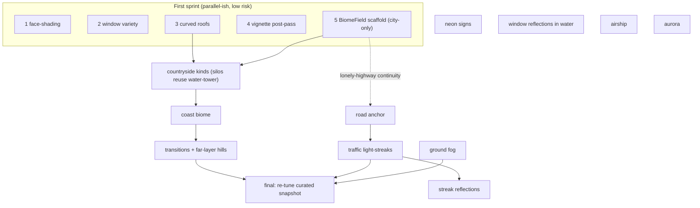

<!--
GENERATED ANALYSIS — @marianmeres/cityscape · visual overhaul
Produced 2026-06-20 by inline scout → verify pass over the codebase.
Claims verified against the codebase at commit 5997d8f. Planning artifact; no code was changed.
-->

# Cityscape Visual Overhaul — Overview & Roadmap

> A focused visual pass on a settled architecture. The brief: keep the calm, painterly **night**
> mood (day mode is explicitly out of scope), and add richness along four axes — per-building
> detail, a macro **biome journey** (country ⇄ city), foreground **light-streak life**, and
> atmospheric polish. The owner chose a **full overhaul** appetite, sequenced so every step ships
> on its own and tests stay green.
>
> The single most important finding: **none of this needs a new `DrawCommand`.** Every effect
> reuses the existing seven primitives ([draw-command.ts](../../src/engine/render/draw-command.ts)),
> so the renderer seam — the architecture's crown jewel — is never disturbed and the ASCII renderer
> keeps working. The only item with real design weight is the biome journey, and the code hands us
> a clean solution: layer a **seeded `biome(worldX)` macro field** over the existing District FSM,
> sampled identically by every parallax band, so the whole frame agrees on "where" it is.
>
> Read order: this file for the map and the first sprint; then the dimension docs
> [01](./01-quick-wins.md)–[04](./04-atmosphere-polish.md) for verified detail; track status in
> [PROGRESS.md](./PROGRESS.md).

## Status — code-complete ✅ (2026-06-20)

All 15 features shipped on branch `visual-overhaul` (tasks 1–15), each `deno check`/`test`-green,
`fmt`-clean, and verified (adversarial workflows on the biome scaffold + countryside; worktree
byte-comparisons proving `biomeVariety = 0` is byte-identical to the original city; per-feature
gating/NaN/determinism probes). A pre-existing starfield bug was fixed along the way. The one
remaining item is **task 16 — re-tune the curated default snapshot**, which is owner-gated (needs
eyes on screen). See [PROGRESS.md](./PROGRESS.md) for the full ledger.

## Top recommendations across all dimensions (ranked)

| Rank | Recommendation                                            | Dimension                          | Value   | Effort | Risk | Why now                                                     |
| ---- | --------------------------------------------------------- | ---------------------------------- | ------- | ------ | ---- | ----------------------------------------------------------- |
| 1    | Directional face-shading on near buildings                | [01](./01-quick-wins.md) #1        | high    | S      | low  | Biggest cheap lift; kills the "papery" near band            |
| 2    | Window variety (lit floors, penthouse, signage, blinds)   | [01](./01-quick-wins.md) #2        | high    | S–M    | low  | Near layer stops reading as a uniform mesh                  |
| 3    | `BiomeField` macro coherence (variety knob, city-only)    | [02](./02-biome-journey.md) #1     | high    | M      | med  | De-risks the centerpiece before any new art                 |
| 4    | Curved roof features (barrel/deco/water-tower)            | [01](./01-quick-wins.md) #3        | med     | S      | low  | Cheap silhouette variety; water-tower feeds the biome silos |
| 5    | Vignette + grain post-pass                                | [01](./01-quick-wins.md) #4        | med     | S      | low  | Renderer-only; large perceived-quality bump                 |
| 6    | Countryside content (tree/barn/silo/field + shape branch) | [02](./02-biome-journey.md) #2     | high    | M      | med  | The visible payoff of the journey                           |
| 7    | Road anchor + `TrafficDirector` light-streaks             | [03](./03-foreground-life.md) #1–2 | high    | M      | low  | Adds human-scale motion; the chosen "life"                  |
| 8    | Coast biome (sparse waterfront)                           | [02](./02-biome-journey.md) #3     | med     | M      | med  | Completes the journey's variety                             |
| 9    | Transition blending + far-layer hills/treeline            | [02](./02-biome-journey.md) #4     | med     | M–L    | med  | Makes the horizon itself change city↔country                |
| 10   | Streak reflections on water                               | [03](./03-foreground-life.md) #3   | med     | S      | low  | Cheap once traffic exists                                   |
| 11   | Ground fog / mist                                         | [04](./04-atmosphere-polish.md) #1 | med     | S–M    | low  | Broad atmospheric depth                                     |
| 12   | Neon rooftop signs                                        | [04](./04-atmosphere-polish.md) #2 | med     | S–M    | low  | Palette/biome identity (vaporwave)                          |
| 13   | Water reflections of near-window lights                   | [04](./04-atmosphere-polish.md) #3 | med     | M      | low  | The marquee night reflection                                |
| 14   | Drifting airship                                          | [04](./04-atmosphere-polish.md) #4 | low–med | S      | low  | Trivial delight                                             |
| 15   | Aurora ribbon                                             | [04](./04-atmosphere-polish.md) #5 | low–med | M      | med  | Lowest priority; easy to overdo                             |

> **Deliberately deferred/cut:** literal cars + pedestrians (owner chose stylized streaks — off-mood
> at this zoom); rounded _building corners_ (imperceptible at skyline scale — replaced by curved
> _roof features_); a dynamic positional waterline for the coast (couples three entities to the
> biome field — faked with sparseness in v1); **day mode** (out of scope by decision).

## Recommended first sprint (do these 3–5 first)

The first sprint front-loads the **low-risk quick wins** (immediate, visible richness with no mood
gamble) and the **biome scaffold** (the one structural risk, proven early with no new art):

1. **Face-shading** ([01](./01-quick-wins.md) #1) — high value, S, no decisions blocking it beyond a
   light-direction taste call. Makes every near building read as a volume. Best lift-to-effort ratio.
2. **Window variety** ([01](./01-quick-wins.md) #2) — high value, S–M. Pairs with #1 to transform
   the near band in one sprint.
3. **Curved roofs** ([01](./01-quick-wins.md) #3) — med, S. Also produces the `water-tower` crown the
   biome silos will reuse, so it unblocks doc 02 #2.
4. **Vignette post-pass** ([01](./01-quick-wins.md) #4) — med, S. Renderer-only; frames everything
   the other three add.
5. **Biome scaffold 2a** ([02](./02-biome-journey.md) #1) — high, M, med-risk. Land `BiomeField` +
   the `biomeVariety` knob with **city kinds only**, proving macro coherence and reversibility
   before investing in countryside art. This is the structural de-risk; everything in doc 02 builds
   on it.

## Cross-cutting themes

- **The seam is untouched.** No new `DrawCommand`; every feature composes the existing seven
  primitives. The ASCII renderer keeps rendering new _shapes_ free (rect/circle/polygon); it just
  won't get glow-subtlety or the vignette — correct, those are raster concerns.
- **Everything is a seeded, live config knob.** Adding a knob is a one-line `CONFIG_SCHEMA` edit and
  the panel + `DEFAULT_CONFIG` follow ([config.ts](../../src/cityscape/config.ts)); the recurring
  discipline is keeping schema↔interface parity ([config.test.ts](../../tests/config.test.ts)) and
  sourcing **all** randomness from `config.seed` via `fork` (no `Math.random`/`Date.now`).
- **Determinism extends to position.** The biome is a pure function of `(seed, worldX)` — same seed
  reproduces the same journey, and the URL-hash permalink still restores exactly.
- **Mood-preservation guardrail.** Keep effects subtle and behind knobs; the curated navy snapshot
  (commit `dfd75ba`) will drift as defaults change — a deliberate **re-tune pass is its own task at
  the end**, not an accident.
- **Watch the draw-command count.** Face-shading (+1 gradient/near building), fog, reflections, and
  traffic all add commands; the costly canvas ops are `gradient` and `glow`. Keep added effects
  scoped to near layers and profile if the near band gets dense.

## Dependency / sequencing notes

## Completeness check

- **Performance** — no single feature is heavy, but they stack draw commands on the near band;
  flagged as a cross-cutting theme, revisit if profiling shows it.
- **Tests** — new pure logic (the biome field) gets a unit test; the `RoofKind`/`BuildingKind`
  union extensions are caught by TypeScript's exhaustive `switch`; visual effects aren't
  Deno-unit-testable (verify via `example/` over http, per [AGENTS.md](../../AGENTS.md)).
- **Snapshot drift** — explicitly owned as a final re-tune task rather than left implicit.
- **Out of scope (noted, not missed)** — day/night cycle and audio are untouched by decision.

Source documents: [01-quick-wins.md](./01-quick-wins.md), [02-biome-journey.md](./02-biome-journey.md),
[03-foreground-life.md](./03-foreground-life.md), [04-atmosphere-polish.md](./04-atmosphere-polish.md).
